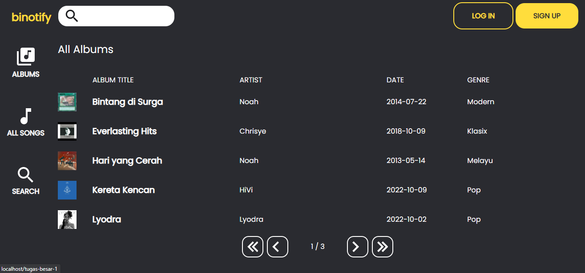
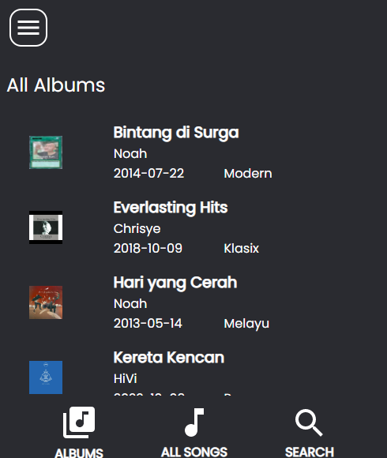
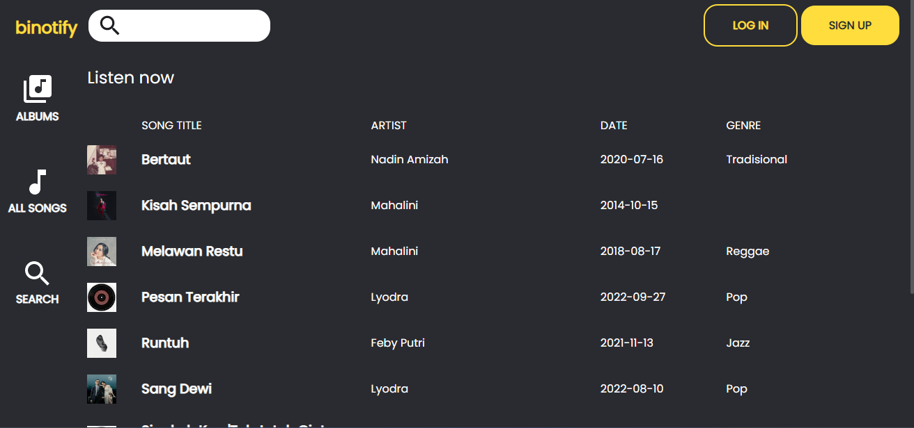
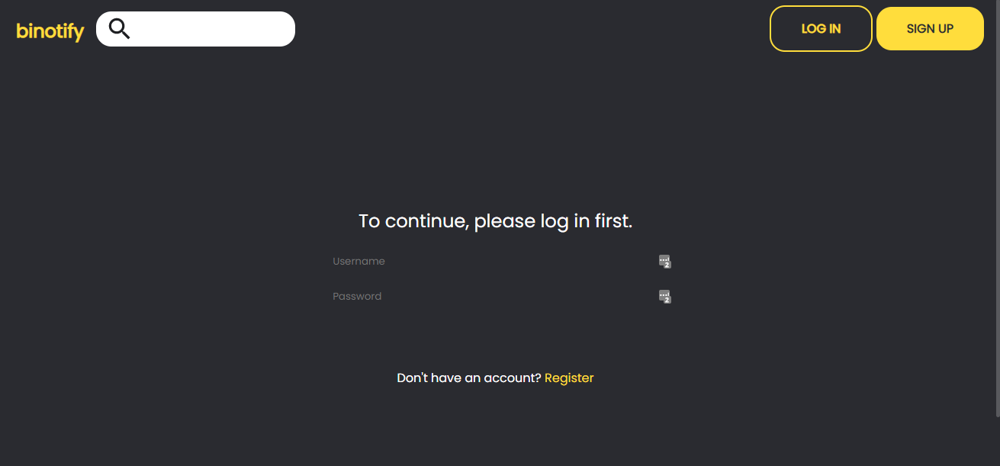
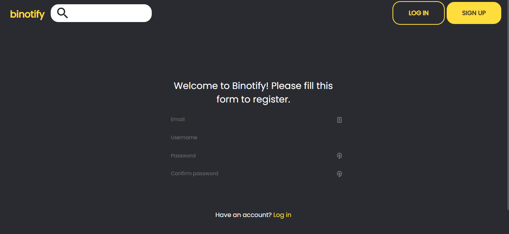
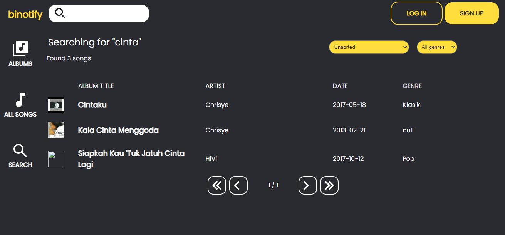

# binotify

Dibuat oleh:
  * Diky Restu Maulana (13520017)
  * Alifia Rahmah (13520122)
  * Andika Naufal Hilmy (13520098)

## Deskripsi singkat aplikasi
Aplikasi **binotify** dibuat untuk memenuhi tugas mata kuliah Pengembangan Aplikasi Berbasis Web. **binotify** adalah aplikasi musik berbasis _web_ yang dapat memutar musik secara _streaming_ dari _server_ ke _client_. Aplikasi ini dibuat dengan menggunakan konsep _Monolithic PHP & Vanilla Web Application_, dengan beberapa fungsionalias menggunakan pemanggilan ke [REST API](https://gitlab.informatika.org/if3110-2022-k02-02-58/rest) dan [SOAP API](https://gitlab.informatika.org/if3110-2022-k02-02-58/soap). Beberapa fitur yang terdapat pada aplikasi ini adalah:

  * _Login_ dan _Register_ user
  * Menampilkan detail album dan lagu di dalamnya
  * Menampilkan detail lagu
  * Memutar lagu
  * _Search_, _sort_, dan _filter_ lagu
  * _Logout_
  * Menampilkan daftar penyanyi dari platform [Binotify Premium](https://gitlab.informatika.org/if3110-2022-k02-02-58/react)
  * Menampilkan daftar lagu dari penyanyi [Binotify Premium](https://gitlab.informatika.org/if3110-2022-k02-02-58/react)

## Daftar _requirements_
  * [MySQL](https://www.mysql.com/downloads/)
  * [PHP](https://www.php.net/downloads.php)
  * [Apache](https://httpd.apache.org/download.cgi)
  * [Docker](https://docs.docker.com/get-docker/)

**Note**: Requirement MySQL, PHP, dan Apache bisa dipaketkan dalam bentuk [XAMPP](https://www.apachefriends.org/download.html)
## Cara Instalasi

### Docker
1. Download atau clone repository ini
2. Masuk ke direktori repository
3. Jalankan perintah `docker-compose build`

## Cara Menjalankan Aplikasi

### Docker
1. Jalankan perintah `docker-compose up` atau `docker-compose up -d` untuk menjalankan aplikasi secara _background_ dari folder repository
2. Akses aplikasi melalui `localhost:8080`

## _Screenshots_

### Album

### Home

### Login & Register

### Search

### Premium Artist
<!-- TODO: add premium artist screenshot -->

### Premium Song
<!-- TODO: add song artist screenshot -->

## Pembagian Tugas

### Server Side
* Login: 13520098
* Register: 13520098
* Home: 13520122
* Daftar Album: 13520122
* Search, Sort, Filter: 13510122
* Detail Lagu: 13520017
* Detail Album: 13520017
* Tambah Album dan Lagu: 13520017
* Daftar User: 13520098
* Daftar Penyanyi Premium: 13520122
* Daftar Lagu Penyanyi Premium: 13520122
### Client Side
* Login: 13520098
* Register: 13520098
* Home: 13520122
* Daftar Album: 13520122
* Search, Sort, Filter: 13510122
* Detail Lagu: 13520017
* Detail Album: 13520017
* Tambah Album dan Lagu: 13520017
* Daftar User: 13520098
* Daftar Penyanyi Premium: 13520122
* Daftar Lagu Penyanyi Premium: 13520122