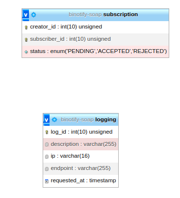

# binotify-soap

Dibuat oleh:

-   Diky Restu Maulana (13520017)
-   Alifia Rahmah (13520122)
-   Andika Naufal Hilmy (13520098)

## Deskripsi singkat aplikasi

SOAP API untuk aplikasi [Binotify App](https://gitlab.informatika.org/if3110-2022-k02-02-58/binotify-app) dan [Binotify Premium](https://gitlab.informatika.org/if3110-2022-k02-02-58/react) menggunakan Java dan [Jakarta EE](https://jakarta.ee/).

Requirements:

1. Java
2. [Maven](https://maven.apache.org/download.cgi)
3. [Docker](https://www.docker.com/)

## Skema basis data



```sql
CREATE TABLE `logging` (
  `id` int(11) NOT NULL,
  `description` char(255) NOT NULL,
  `ip` char(16) NOT NULL,
  `endpoint` char(255) NOT NULL,
  `requested_at` timestamp NOT NULL DEFAULT '0000-00-00 00:00:00' ON UPDATE current_timestamp()
)
CREATE TABLE `subscription` (
  `creator_id` int(11) NOT NULL,
  `subscriber_id` int(11) NOT NULL,
  `status` enum('PENDING','ACCEPTED','REJECTED') NOT NULL DEFAULT 'PENDING',
  PRIMARY KEY (`creator_id`,`subscriber_id`)
)
```

## Endpoint, payload, dan response API
Selengkapnya dapat dilihat di [Dokumentasi Postman binotify-soap](https://documenter.getpostman.com/view/21666063/2s8YzL46Jb)

## Pembagian tugas

Daftar permintaan subscription: 13520098
Menerima/menolak permintaan subscription: 13520098
Logging: 13520098
